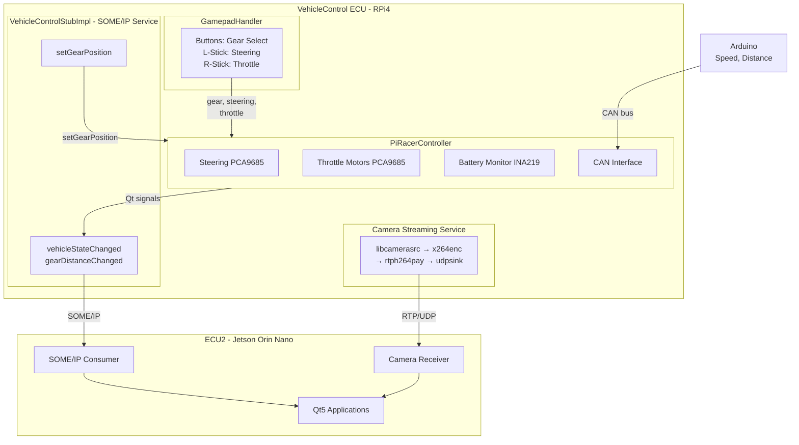

# **VehicleControl ECU**

---

# Result

<!-- TODO: Add demo video link -->
<!-- [](https://www.youtube.com/watch?v=VIDEO_ID) -->

---

# Introduction

<table border="0" rules="none">
<tr border="0">
    <td width="280" height="200" align="center">
        <a href="https://www.yoctoproject.org/">
            
        </a>
    </td>
    <td width="280" height="200" align="center">
        <a href="https://github.com/COVESA/vsomeip">
            
        </a>
    </td>
    <td width="280" height="200" align="center">
        <a href="https://libcamera.org/">
            
        </a>
    </td>
    <td width="280" height="200" align="center">
        <a href="https://gstreamer.freedesktop.org/">
            
        </a>
    </td>
</tr>
</table>

The **VehicleControl ECU** is the hardware control unit (ECU1) of the DES_Head-Unit distributed automotive infotainment system, developed as part of the **SEA:ME** (Software Engineering for Automotive and Mobility Engineers) program.

Running on a **Raspberry Pi 4** with a custom **Yocto Linux** image, ECU1 has three distinct responsibilities:

1. **Physical Vehicle Control** — Motor actuation and steering via PCA9685 PWM controllers, battery monitoring via INA219, and gamepad input handling for manual driving
2. **Sensor Data Collection** — Receiving speed and distance data from an Arduino over CAN bus
3. **SOME/IP Service Provider** — Exposing vehicle state data (gear, speed, battery, distance) to ECU2 over Ethernet using the **vsomeip/CommonAPI** middleware stack, and accepting remote commands (e.g., gear change) from the head unit

Additionally, a separate **camera streaming service** runs independently on ECU1, streaming the picamera(OV5647 camera) feed to ECU2 via RTP/UDP using GStreamer.

The system is built around the **PiRacer AI Kit**, providing vehicle control with a gamepad interface, while exposing all vehicle state data as SOME/IP service events for consumption by the head unit and instrument cluster applications on ECU2.

---

# Architecture

## Software Architecture

<!-- TODO: Replace with actual architecture diagram -->
<!--  -->



## Hardware Architecture

<!-- TODO: Replace with actual hardware diagram -->
<!--  -->

```
                    ┌─────────────────────────────────┐
                    │       Raspberry Pi 4 (ECU1)     │
                    │         192.168.1.100           │
                    │                                 │
  ┌──────────┐      │  ┌──────┐  ┌──────┐  ┌──────┐  │      ┌──────────┐
  │ Shanwan  │ USB  │  │ I2C  │  │ SPI  │  │ CSI  │  │ ETH  │  Jetson  │
  │ Gamepad  ├─────►│  │ Bus  │  │ Bus  │  │ Port │  ├─────►│  Orin    │
  │          │      │  └──┬───┘  └──┬───┘  └──┬───┘  │      │  Nano    │
  └──────────┘      │     │         │         │      │      │  (ECU2)  │
                    │     ▼         ▼         ▼      │      └──────────┘
                    │  ┌──────┐ ┌───────┐ ┌───────┐  │
                    │  │0x40  │ │MCP251x│ │OV5647 │  │
                    │  │Steer │ │FD CAN │ │Camera │  │
                    │  │PCA968│ │ HAT   │ │Module │  │
                    │  └──────┘ └───┬───┘ └───────┘  │
                    │  ┌──────┐     │                 │
                    │  │0x60  │     │                 │
                    │  │Motor │     ▼                 │
                    │  │PCA968│ ┌───────┐             │
                    │  └──────┘ │Arduino│             │
                    │  ┌──────┐ │(Speed │             │
                    │  │0x41  │ │ Dist) │             │
                    │  │INA219│ └───────┘             │
                    │  │Batt. │                       │
                    │  └──────┘                       │
                    └─────────────────────────────────┘
```

---

# Setting

## Raspberry Pi 4 Model B

- Raspberry Pi 4 Model B (4GB RAM)
- OV5647 Camera Module v1.3 (CSI interface)
- PiRacer AI Kit
  - PCA9685 PWM Controller @ I2C 0x40 (Steering servo, 50Hz)
  - PCA9685 PWM Controller @ I2C 0x60 (Throttle motors, 50Hz)
  - INA219 Current/Voltage Sensor @ I2C 0x41 (3S LiPo battery monitoring)
- Waveshare 2-CH CAN FD HAT (MCP251xFD via SPI)
- Shanwan USB Gamepad Controller
- Ethernet cable (direct connection to ECU2)
- MicroSD card (16GB+, flashed with Yocto image)

## Arduino UNO

- Speed sensor (wheel encoder)
- HC-SR04 Ultrasonic distance sensor
- MCP2515 CAN Shield (1000 kbps, matching ECU1)
- CAN Frame ID: 0x0F6
  - Bytes 0-2: Speed (cm/s, big-endian int16 + decimal uint8)
  - Bytes 3-6: Distance (cm, little-endian float)

## Network Configuration

| Device | Interface | IP Address | Role |
|--------|-----------|-----------|------|
| ECU1 (Raspberry Pi 4) | eth0 | 192.168.1.100/24 | SOME/IP Provider + Camera Sender |
| ECU2 (Jetson Orin Nano) | eth0 | 192.168.1.101/24 | SOME/IP Consumer + Camera Receiver |

---

# Usage

## Building the Yocto Image

```bash
# 1. Navigate to Yocto build directory
cd /path/to/yocto-build

# 2. Initialize build environment
source sources/poky/oe-init-build-env build

# 3. Build the VehicleControl ECU image
bitbake vehiclecontrol-image
```

## Flashing to SD Card

```bash
sudo dd if=tmp/deploy/images/raspberrypi4-64/vehiclecontrol-image-raspberrypi4-64.wic of=/dev/sdX bs=4M status=progress
sync
```

## Verifying Services After Boot

```bash
# Check VehicleControl ECU service
systemctl status vehiclecontrol-ecu.service

# Check camera streaming service
systemctl status camera-streaming.service

# Check CAN interface
systemctl status can-setup.service
ip link show can0

# Check network connectivity to ECU2
ping -c 3 192.168.1.101

# View service logs
journalctl -u vehiclecontrol-ecu.service -f
journalctl -u camera-streaming.service -f
```

## Receiving Camera Stream on ECU2 (Jetson Orin Nano)

```bash
export DISPLAY=:0
gst-launch-1.0 udpsrc port=5000 \
    caps="application/x-rtp,encoding-name=H264,payload=96" \
    ! rtph264depay ! h264parse ! nvv4l2decoder ! nv3dsink
```

---

# Key Concept

## vsomeip & CommonAPI

### What is SOME/IP?

**SOME/IP** (Scalable service-Oriented MiddlwarE over IP) is an automotive middleware protocol standardized by AUTOSAR. It enables service-oriented communication between ECUs over standard Ethernet networks, replacing traditional signal-based CAN communication for high-bandwidth data exchange.

### Why vsomeip and CommonAPI?

In this project, the VehicleControlECU application on ECU1 handles physical vehicle control (motors, steering, battery) and collects sensor data from Arduino via CAN bus. It then acts as a **SOME/IP service provider**, exposing this vehicle state data (gear, speed, battery, distance) to any consumer on the network. ECU2 subscribes to these events to update its head unit and instrument cluster displays. Note that camera streaming is a separate systemd service — it does not go through SOME/IP.

1. **Service Discovery** — ECU2 automatically discovers ECU1's services via multicast (224.244.224.245:30490), eliminating hardcoded addresses for service endpoints
2. **Event-based Communication** — Vehicle state changes are broadcast as events, allowing multiple consumers (GearApp, SpeedApp, BatteryApp, PDCApp) to subscribe independently
3. **RPC Methods** — ECU2 can call `setGearPosition()` on ECU1 remotely, enabling bidirectional control
4. **CommonAPI Abstraction** — FIDL interface definitions generate type-safe C++ proxy/stub code, decoupling application logic from the transport protocol

### Service Configuration

| Parameter | Value |
|-----------|-------|
| Service ID | 0x1234 |
| Instance ID | 0x5678 |
| Application ID | 0x1001 |
| Unicast | 192.168.1.100 |
| UDP Port (unreliable) | 30501 |
| TCP Port (reliable) | 30502 |
| SD Multicast | 224.244.224.245:30490 |

## Yocto Project

### What is the Yocto Project?

The **Yocto Project** is an open-source collaboration project that provides templates, tools, and methods to create custom Linux-based systems for embedded products. It uses **BitBake** as its build engine and **OpenEmbedded** as its build framework to cross-compile entire Linux distributions.

### Why Yocto for ECU1?

1. **Minimal Footprint** — The `vehiclecontrol-image` produces a ~512MB root filesystem containing only the packages needed for ECU1, unlike a full Raspberry Pi OS (~4GB)
2. **Reproducible Builds** — Every package version, kernel configuration, and system service is defined in recipes, ensuring identical builds across developers and CI/CD
3. **Custom Kernel Configuration** — Device tree overlays for OV5647 camera, MCP251xFD CAN controller, I2C sensors, and SPI are configured at the kernel level
4. **systemd Integration** — Services (vehiclecontrol-ecu, camera-streaming, can-setup) start automatically on boot with proper dependency ordering
5. **Cross-compilation** — All C++ applications, libraries (vsomeip, CommonAPI, pigpio), and GStreamer plugins are cross-compiled for ARM64 from an x86_64 host

### meta-vehiclecontrol Layer Structure

```
meta-vehiclecontrol/
├── conf/                              # Layer and machine configuration
├── recipes-bsp/                       # Boot configuration (config.txt, device tree)
├── recipes-core/                      # Image recipe, systemd network, udev rules
├── recipes-connectivity/              # vsomeip, CommonAPI, CAN setup, WiFi, SSH
├── recipes-kernel/                    # Kernel config (camera, CAN, Bluetooth modules)
├── recipes-multimedia/                # libcamera IPA fix, camera streaming service
├── recipes-support/                   # pigpio library
└── recipes-vehiclecontrol/            # VehicleControlECU application recipe
```

## libcamera

### What is libcamera?

**libcamera** is an open-source camera stack for Linux that provides a unified API for camera hardware. It replaces the legacy V4L2 camera interface with a modern architecture that includes **IPA (Image Processing Algorithm)** modules for per-platform image tuning.

### Why libcamera for ECU1?

1. **Raspberry Pi IPA Module** — The OV5647 camera sensor requires Raspberry Pi-specific image processing (auto-exposure, white balance, lens shading correction) that only the `ipa_rpi.so` module provides
2. **GStreamer Integration** — The `libcamerasrc` GStreamer element provides direct access to the camera pipeline without manual V4L2 configuration
3. **Yocto Fix** — The base Yocto libcamera recipe builds only the `vimc` (virtual camera) IPA module. The `meta-vehiclecontrol` layer overrides this with `-Dipas=raspberrypi` to build the correct IPA module and packages it into the image

### Key Configuration (libcamera.bbappend)

```bitbake
# Build Raspberry Pi IPA instead of vimc
EXTRA_OEMESON:remove:rpi = "-Dipas=vimc"
EXTRA_OEMESON:append:rpi = " -Dipas=raspberrypi"

# Package IPA modules into the final image
FILES:${PN} += "${libdir}/libcamera/*.so"
FILES:${PN} += "${libdir}/libcamera/*.so.sign"
```

## GStreamer

### What is GStreamer?

**GStreamer** is an open-source multimedia framework that allows construction of media processing pipelines. Elements are linked together to form a pipeline that processes media data from source to sink.

### Why GStreamer for Camera Streaming?

1. **Pipeline Architecture** — GStreamer's plugin-based design allows composing the exact pipeline needed: camera capture → encoding → network transport
2. **Hardware Acceleration** — On the Jetson receiver side, `nvv4l2decoder` provides hardware H.264 decoding with minimal CPU usage
3. **RTP/UDP Transport** — Low-latency, real-time streaming over standard UDP with RTP packetization, ideal for reverse camera feed
4. **Zero-latency Encoding** — x264enc with `tune=zerolatency` minimizes encoding delay for real-time video

### Camera Streaming Pipeline

**Sender (ECU1 — Raspberry Pi 4):**
```
libcamerasrc → video/x-raw,1280x720@30fps → videoconvert → x264enc
    (tune=zerolatency, bitrate=4000, speed-preset=ultrafast)
    → h264parse (config-interval=1) → rtph264pay (pt=96)
    → udpsink (host=192.168.1.101, port=5000)
```

**Receiver (ECU2 — Jetson Orin Nano):**
```
udpsrc (port=5000) → rtph264depay → h264parse
    → nvv4l2decoder → nv3dsink
```

## PiRacer Hardware Control

### What is PiRacer?

The **PiRacer** is an AI racing robot kit built around Raspberry Pi, using PCA9685 PWM controllers for motor and servo control, and I2C sensors for telemetry.

### Hardware Interface Map

| Bus | Address | Device | Function |
|-----|---------|--------|----------|
| I2C-1 | 0x40 | PCA9685 | Steering servo (Channel 0, 50Hz PWM) |
| I2C-1 | 0x60 | PCA9685 | Throttle motors (Left: Ch5-7, Right: Ch0-2) |
| I2C-1 | 0x41 | INA219 | Battery monitor (3S LiPo, 9.0V-12.6V) |
| SPI | — | MCP251xFD | CAN transceiver (1000 kbps) |
| CSI | — | OV5647 | Camera module (1280x720 @ 30fps) |
| USB | /dev/input/js0 | Shanwan | Gamepad controller (50Hz polling) |

### Gamepad Input Mapping

| Input | Action |
|-------|--------|
| Button A | Gear: Drive |
| Button B | Gear: Neutral |
| Button X | Gear: Park |
| Button Y | Gear: Reverse |
| Left Stick X-axis | Steering (-1.0 to 1.0) |
| Right Stick Y-axis | Throttle (-1.0 to 1.0, capped at 50%) |

### Gear Behavior

| Gear | Throttle Behavior |
|------|-------------------|
| Park (P) | All movement blocked |
| Reverse (R) | Backward only |
| Neutral (N) | All movement blocked |
| Drive (D) | Forward only |

---

# References

- [vsomeip](https://github.com/COVESA/vsomeip) — SOME/IP implementation by COVESA
- [CommonAPI C++ Core](https://github.com/COVESA/capicxx-core-runtime) — Language binding for automotive middleware
- [CommonAPI C++ SomeIP](https://github.com/COVESA/capicxx-someip-runtime) — SOME/IP binding for CommonAPI
- [Yocto Project](https://www.yoctoproject.org/) — Embedded Linux build system
- [libcamera](https://libcamera.org/) — Open-source camera stack for Linux
- [GStreamer](https://gstreamer.freedesktop.org/) — Open-source multimedia framework
- [pigpio](https://abyz.me.uk/rpi/pigpio/) — Raspberry Pi GPIO library
- [PCA9685 Datasheet](https://www.nxp.com/docs/en/data-sheet/PCA9685.pdf) — 16-channel PWM controller
- [INA219 Datasheet](https://www.ti.com/lit/ds/symlink/ina219.pdf) — Current/voltage monitor

---

# License

<!-- TODO: Choose and uncomment appropriate license -->
<!--
[](https://creativecommons.org/licenses/by-nc-sa/4.0/)

This work is licensed under a [Creative Commons Attribution-NonCommercial-ShareAlike 4.0 International License](https://creativecommons.org/licenses/by-nc-sa/4.0/).
-->
